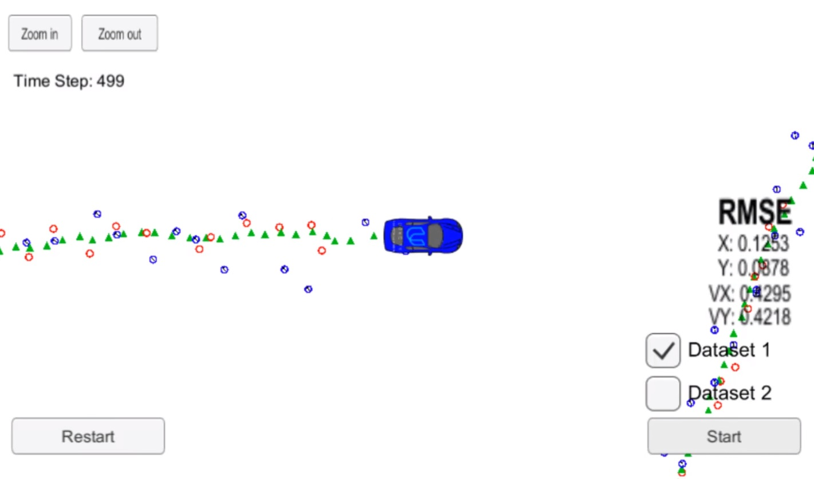

# Unscented Kalman Filter 

Skills
---
* Sensor Fusion
  * Unscented Kalman Filter
* C++ 

Overview
---

An unscented kalman filter is used to interpret noisy lidar and radar measurements from the simulator. The code then plots the position estimate in the simulator, allowing for visual comparison of the estimation versus the actual position. 

This project was completed as an assignment for Udacity's Self Driving Car Nano Degree .

This project began with the starter code provided [here](https://github.com/udacity/CarND-Unscented-Kalman-Filter-Project.git)

Contents and Code Structure (All in src)
---

* ukf
    * initializes the Unscented Kalman filter, calls the predict and update function, defines the predict and update functions
* main
    *  reads in data, calls a function to run the Unscented Kalman filter, calls a function to calculate RMSE
* tools
    * function to calculate RMSE 

Dependencies
---

* Udacity Term 2 Simulator, which can be downloaded [here](https://github.com/udacity/self-driving-car-sim/releases)
* uWebSocketIO
    * To accomplish this (and all dependencies) I used the Udacity Docker image on Windows. Instructions for how to do that can be found [here](https://discussions.udacity.com/t/getting-started-with-docker-and-windows-for-the-ekf-project-a-guide/320236)
        * For security reasons, the VM does not automatically open port forwarding, so you need to manually enable port 4567. This is needed for the C++ program to successfully connect to the host simulator.
			1. Port Forwarding Instructions
			2. First open up Oracle VM VirtualBox
			3. Click on the default session and select settings.
			4. Click on Network, and then Advanced.
			5. Click on Port Forwarding
			6. Click on the green plus, adds new port forwarding rule.
			7. Add a rule that assigns 4567 as both the host port and guest Port, as in the screenshot.

Build Instructions
---

Once the install for uWebSocketIO is complete, the main program can be built and run by doing the following from the project top directory.

1. mkdir build
2. cd build
3. cmake ..
4. make
5. ./UnscentedKF

Other Dependencies (if not using Docker Image)
---

* cmake >= 3.5
  * All OSes: [click here for installation instructions](https://cmake.org/install/)
* make >= 4.1 (Linux, Mac), 3.81 (Windows)
  * Linux: make is installed by default on most Linux distros
  * Mac: [install Xcode command line tools to get make](https://developer.apple.com/xcode/features/)
  * Windows: [Click here for installation instructions](http://gnuwin32.sourceforge.net/packages/make.htm)
* gcc/g++ >= 5.4
  * Linux: gcc / g++ is installed by default on most Linux distros
  * Mac: same deal as make - [install Xcode command line tools](https://developer.apple.com/xcode/features/)
  * Windows: recommend using [MinGW](http://www.mingw.org/)
